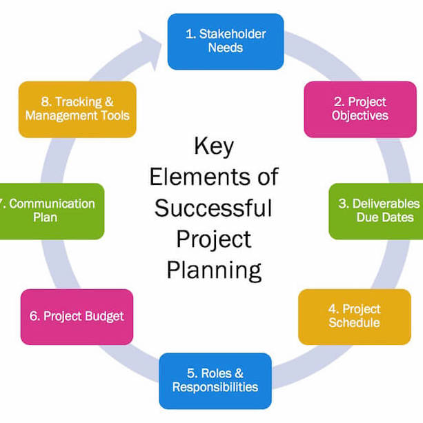
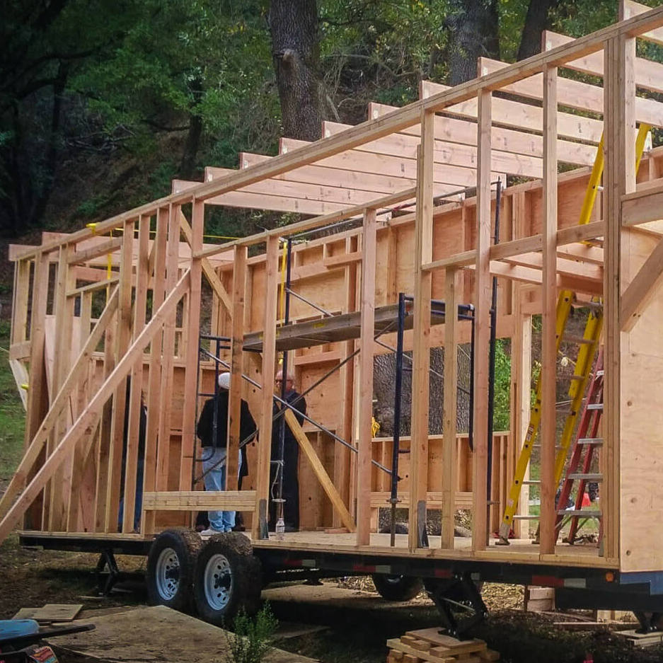

  
  
  
  

In high school I took a class that focused on project development. One of the main projects in my senior year of high school was the development of Tiny Houses within a budget and to find a way to make them sustainable. The class project was divided up into three parts; brainstorming on the idea, writing a development plan for the idea, and eventually find a company that would want to collborate with us on our design. This project really showed me and my team what project development is like.

This project focused on building Tiny Houses that would be sustainable. It was our goal to develop a plan to build tiny houses that would use the least amount of resources possible. To make the Tiny Houses sustainable, we made use of green energy. In our development plan, we designed the Tiny Houses with solar pannels and (tiny) windmills that would provide enough enery for the house to have warm water, be able to cook, etc. 

For this project, I was the contact person who was responsible for contacting companies and presenting them with our idea. I had to start contacting companies in the early phases of our project to make sure that we would have a company who would want to collaborate with us on our project by the time we would need it. I was the main person who wrote our the planning for the whole project. We had 3 months to finish this project and I was responsible for writing down a planning that would make sure we would finish the project before the deadline, but also to make sure there was enough room for error in our planning. Not everything goes as plannend in project development, so we had to make sure there was enough time and space in our planning for errors. Eventually, we did find a company and we finished our project in time.

